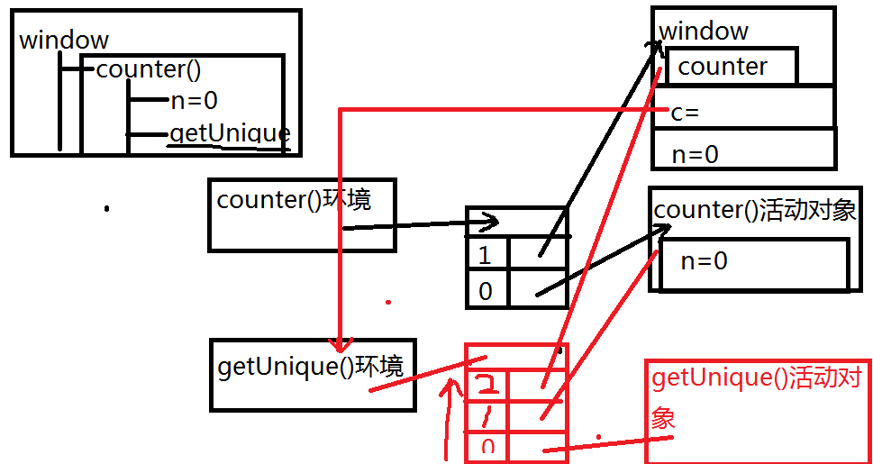

# 闭包
> 闭包并不是新的知识，其实在你的代码中已经到处是闭包(setTimeout,jQuery的事件绑定啊)，只不过你未曾彻底理解他们
**概念: 当函数可以记住并访问所在的作用域时，就产生了闭包（直白点，就是函数外使用了不属于自己的局部变量）**
```
function foo(){
    var a  =  2; // 我是局部变量
    function bar(){
        console.log(a);//a 不是我的作用域内的变量
    }
    return bar;
}
var baz = foo();
baz();//2 - 看我，看我，这就是闭包的效果
```
## 循环和闭包
```
for(var i=1;i<=5;i++){
    setTimeout(function(){
        console.log(i);
    },i*1000);
}
//每隔1s 输出一个 6，共5个
//共享了一个 i
```
```
for(var i=1;i<=5;i++){
    (function(){
        setTimeout(function(){
            console.log(i);
        },i*1000)
    })();
}
// 每隔1s 输出一个 6，共5个
```
```
for(var i=1;i<=5;i++){
    (function(i){
        setTimeout(function(){
            console.log(i);
        },i*1000)
    })(i);
}
// 每隔1s，依次输出 1 2 3 4 5
```
## 闭包带来的问题
> 1.内容泄露
> - 普通方法调用完，活动对象回收，而闭包导致父方法活动对象不释放
> 2.变量被公用了
> - 闭包中多个方法，访问的是同一个局部变量，只要变量变化，所有方法都受影响！
> 3. this对象被绑定到window了
> - 解决办法: var that = this;
```
var name = "The Window";
var obj = {
    name : "myObj",
    getName : function(){
        return this.name;
    }
};
console(obj.getName());//myObj
console((obj.getName)());//myObj
console((obj.getName = obj.getName)());//The Window,变成了闭包了
```

## 深层次理解闭包
```
var counter=function(n){
    //var n=0;
    function getUnique(){
        return n++;
    }
    return getUnique;
}
/*调用方法创建3个对象:
  方法运行时的环境对象:不保存任何东西
  方法的活动对象:保存所有局部变量
  方法的作用域链:保存所有可用变量所在对象的地址
  方法调用完，活动对象被回收
*/
var c=counter(n);
//调用完，活动对象没有被释放，因为c还在用
//c中保存的是可以执行的方法对象
console.log(c());//0
console.log(c());//1
console.log(c());//2
n=0;//自动声明为全局！
console.log(c());//3
console.log(c());//4
console.log(c());//5
c=null;//释放闭包占用的资源！
```

```
function counter(){
    var n=0;
    var getUnique = function(){return n++;};
    var reset = function(){n=0;};
    return [getUnique,reset];
}
var funcs = counter();//[function(){return n++;},function(){n=0;}]
//取数
funcs[0]();//1
funcs[0]();//2
funcs[0]();//3
//重置
funcs[1]();//将置为0
```

**来看一道面试题***
```
(function(){
    var name = "";
    var Person = function(value){
        name = value;
    };
    Person.prototype.getName = function(){
        return name;
    };
    Person.prototype.setName = function(value){
        name = value;
    };
    window['Person'] = Person;
})();
var person1 = new Person("gzf");
console.log(person1.getName());//gzf    
person1.setName("gf");
console.log(person1.getName());//gf
var person2 = new Person("mm");
console.log(person2.getName());//mm
console.log(person1.getName());//mm
```
