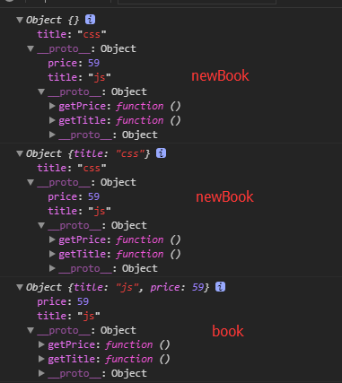

# Object.create(被继承的对象)
> 返回一个新的对象(儿子)
> 实现寄生工厂模式(原子模式)

```
function Book(title, price){
    if(this instanceof Book){
        this.title = title;
        this.price = price;
    }else{
        return new Book(title, price);
    }
}
Book.prototype = {
    getTitle : function(){
        console.log(this.title);
    },
    getPrice : function(){
        console.log(this.price);
    }
}
var book = Book('js', 59);
book.getPrice();//59
//我们想继承book对象
var newBook = Object.create(book);
newBook.title = 'css';
console.log(newBook.title);//css
console.log(book.title);//js
newBook.getTitle();//css
book.getTitle();//js
```


## prototype继承
```
function Zi(title,price,type){
    // Book.call(this, title, price);
    this.title = title;
    this.price = price;
    this.type = type;
}
Zi.prototype = Object.create(Book.prototype);
Zi.prototype.getAct = function(){
    console.log(this.type);
};
var z = new Zi('NBA',29,'体育');
console.log(book);
console.log(z);
z.getAct();//体育
z.getTitle();//NBA
```

##  实现create方法
```
/**
 * @obj 被继承的对象
 */
function create(obj){
    //创建一个类，让原型执行obj，返回实例化结果
    function F(){}
    F.prototype = obj;
    return new F();
}
var myBook = create(book);
console.log(myBook);
```