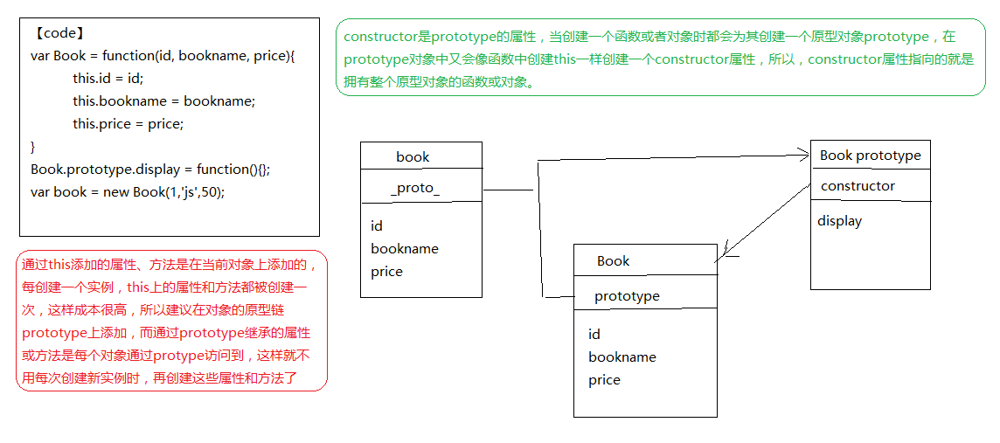

# 面向对象

## 原型
**所有普通的原型链最终都会指向内置的Object.proptytype**,因此任何对象都可以使用toString() valueOf()等方法**

```
//....code1
var obj = {a:2};
//当试图引用对象的属性时会触发对象的内置get方法，比如obj.a,对于默认的get操作来说，第一步是检查对象本身是否有这个属性，如果有就使用它，如果a不在obj中，就需要使用对象的prototype,也就是原型链
//....code2
var anotherObj = {a:2};
var obj = Obj.create(anotherObj);//现在obj对象的原型链prototype关联到了anotherObj
anotherObj.a;//2
obj.a;//2
anotherObj.hasOwnProperty('a');//true
obj.hasOwnProperty('a');//false
obj.a++;//  obj.a = obj.a + 1; 先通过prototype查找属性a并从anotherObj获取当前属性值2，然后+1，然后用set 3 给obj中新鲜的屏蔽属性a
anotherObj.a;//2;
obj.a;//3
obj.hasOwnProperty('a');//true
```
> 天呐，修改委托属性时一定要小心啊，还是anotherObj++吧，别干那种脱裤子放屁的事情了

## 类
> Javasript和面向类语言不同，它并没有类来作为对象的抽象模式，Javascript只有对象
> 其实，Javasript才更应该被称为"面向对象"的语言，因为它是少有的可以不通过类，直接创建对象的语言
> **重要的事说三遍，Javasript中只有对象，Javasript中只有对象，，Javasript中只有对象，**
### 类函数
> 多年以来，Javasript有一种奇怪的行为一直在被无耻地滥用，那就是模仿类
```
var Foo = function(){}
Foo.prototype = {}
var a = new Foo();
Object.getPrototypeOf(a) === Foo.prototype;//true
a.constructor === Foo;//true
```
### 原型继承
```
function Foo(name){
    this.name = name;
}
Foo.prototype.myName = function(){
    return this.name;
}
function Bar(name,label){
    Foo.call(this, name);
    this.label = label;
}
//创建一个新的Bar.prototype对象并关联到Foo.prototype
Bar.prototype = Object.create(Foo.prototype);
//注意: 现在没有Bar.prototype.constructor
Bar.prototype.myLabel(){
    return this.label;
}
var a = new Bar('a','object a');
a.myName;//a
a.myLabel;//object a
a instanceof Bar;//true
//下面是两种常见的错误做法
1. Bar.prototype = Foo.prototype; (子类一改，父类也被修改了)
- 并不会创建一个关联到Bar.prototype的系对象，它只是让Bar.prototype直接引用Foo.prototype对象，因此执行Bar.prototype里面的方法时，会直接修改Foo.prototype对象本身。
2. Bar.prototype = new Foo();
- 的确会创建一个关联到Bar.prototype的新对象，但它使用了Foo的构造函数调用，如果函数Foo有一些副作用(比如写日志，修改状态，注册到其他对象，给this添加属性)的话，就会影响到Bar()的后代，
```
> 创建一个合适的关联对象，我们必须使用Object.create(),而不是使用具有副作用的Foo()
> - ES6之前需要抛弃默认的Bar.prototype
> Bar.prototype = Object.create(Foo.prototype);
> - ES6开始可以直接修改现有的Bar.prototype
> Object.setPrototypeOf(Bar.prototype, Foo.prototype)

鄙视题
```
function Student(name){
    this.name = name;
}
var lilei = new Student('lilei');
var hmm = new Student('hmm');
Student.prototype.count = 10;
lilei.count;//10
hmm.count;//10    l和hmm共享了原型链prototype.count
//任何对象无权修改原型中的数据，原型只能读，不能写，如果赋值,会自动为对象创建同名自有属性count(相当于从原型中获取共享属性，然后私有化，与共享属性分离
lilei.count--;//9
lilei.count--;//8
hmm.count;//10
Student.prototype.count--;
lilei.count;//8,自己有就不会上原型去寻找了,因为lilei.count--创建了私有化
hmm.count;//9 用的是原型的共享属性
delete lilei.count;//删除lilei自己的属性，如果再取count，则是原型的共享属性
lilei.count;//9
delete Student.prototype.count;//删除共有的原型属性
lilei.count;//undefined
hmm.count;//undefined
```

## 继承总结
> 1.凡是希望共有的属性都要设置在原型对象中
> 构造函数.prototype.共有属性名=值
> 对象.__proto__.共有属性名=值
> 2.凡是用对象直接设置的属性一定是当前对象独有！
> 对象.自有属性=值
> 3.继承：将子类型对象的原型，修改为要继承的父类型对象！
> - 原型继承：一切继承都是通过修改原型对象实现的
```
function Person(){}
function Student(){}
1.别用:如果改变了Student的属性，那么连Person也一起改了
Student.prototype = Person.prototype;
Object.setPrototypeOf(Student,Person);
2.别用
Student.prototype = new Person();
3.别用
Student.prototype.constructor = Person;
4.理想方式：自己的修改不会影响原型链
Student.prototype = Object.create(Person.prototype);
```
